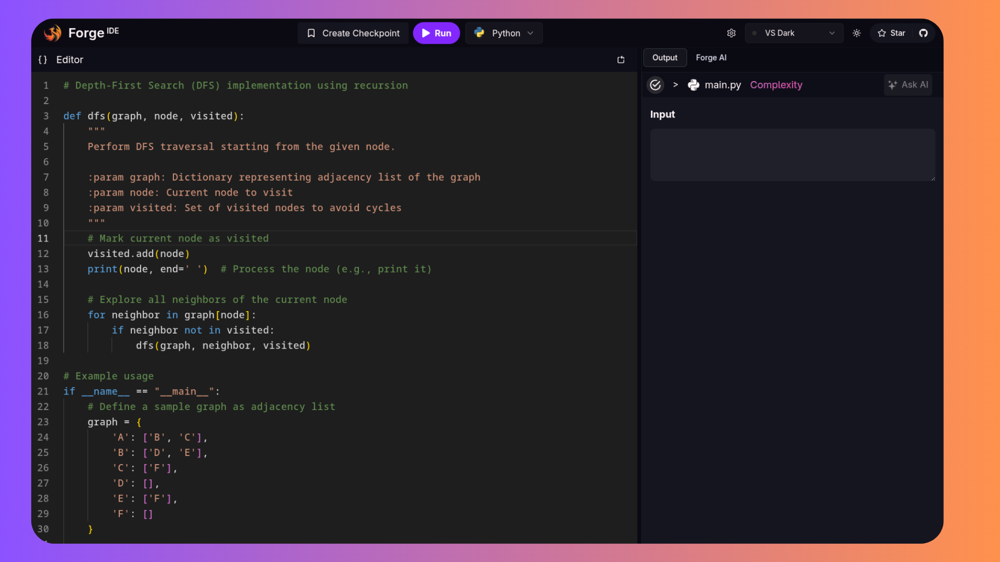

# Forge - AI-Powered Code Editor

<div align="center">


**A modern, AI-powered online code editor with multi-language support and intelligent assistance**

[](https://forgeide.vercel.app)
[](https://nextjs.org/)
[](https://www.typescriptlang.org/)
[](https://tailwindcss.com/)

</div>

## 🚀 Overview

Forge is a feature-rich, browser-based code editor that combines the power of Monaco Editor with AI assistance to provide an exceptional coding experience. Whether you're learning to code, prototyping ideas, or working on projects, Forge offers a seamless environment with support for multiple programming languages.

## ✨ Key Features

### 🎯 **Multi-Language Support**
- **10+ Programming Languages**: JavaScript, TypeScript, Python, Java, Go, Rust, C++, C#, Ruby, Swift
- **Syntax Highlighting**: Advanced syntax highlighting powered by Monaco Editor
- **Language-Specific Templates**: Pre-configured starter code for each language

### 🤖 **AI-Powered Assistant**
- **Forge AI**: Integrated AI assistant for code help, debugging, and explanations
- **Real-time Chat**: Interactive chat interface with markdown support
- **Code Analysis**: Get insights and suggestions for your code
- **Streaming Responses**: Real-time AI responses with typing indicators

### 💾 **Checkpoint System**
- **Save Snapshots**: Create named checkpoints of your code
- **Version Control**: Manage multiple versions of your projects
- **Quick Access**: Easy navigation between saved checkpoints
- **Download Support**: Export your code as files

### 🎨 **Customizable Interface**
- **Multiple Themes**: VS Dark, VS Light, GitHub Dark, Monokai, Solarized Dark
- **Responsive Design**: Optimized for desktop and mobile devices
- **Resizable Panels**: Flexible layout with adjustable panel sizes
- **Font Customization**: Adjustable font sizes and ligature support

### ⚡ **Code Execution**
- **Run Code**: Execute code directly in the browser
- **Output Panel**: View execution results and errors
- **Multiple Runtimes**: Support for various language versions via Piston API

### 🔐 **User Authentication**
- **Clerk Integration**: Secure authentication system
- **User Profiles**: Personalized experience with user avatars
- **Session Management**: Persistent login across sessions

## 📸 Screenshots

### Main Editor Interface

*The main coding interface with syntax highlighting and AI assistant*


## 🛠️ Tech Stack

### Frontend
- **Next.js 15.2.4** - React framework with App Router
- **TypeScript** - Type-safe JavaScript
- **Tailwind CSS 4.0** - Utility-first CSS framework
- **Monaco Editor** - VS Code's editor in the browser
- **Framer Motion** - Smooth animations and transitions

### UI Components
- **Radix UI** - Accessible component primitives
- **Lucide React** - Beautiful icon library
- **React Markdown** - Markdown rendering for AI responses
- **Syntax Highlighter** - Code syntax highlighting

### State Management
- **Zustand** - Lightweight state management
- **React Hooks** - Built-in state management

### Authentication & Backend
- **Clerk** - User authentication and management
- **Convex** - Backend-as-a-Service for real-time data
- **Google Generative AI** - AI-powered code assistance

### Development Tools
- **ESLint** - Code linting and formatting
- **PostCSS** - CSS processing
- **Turbopack** - Fast bundler for development

## 🚀 Getting Started

### Prerequisites
- Node.js 18+
- npm, yarn, pnpm, or bun

### Installation

1. **Clone the repository**
   ```bash
   git clone https://github.com/yourusername/forge.git
   cd forge
   ```

2. **Install dependencies**
   ```bash
   npm install
   # or
   yarn install
   # or
   pnpm install
   ```

3. **Set up environment variables**
   ```bash
   cp .env.example .env.local
   ```

   Fill in your environment variables:
   ```env
   NEXT_PUBLIC_CLERK_PUBLISHABLE_KEY=your_clerk_key
   CLERK_SECRET_KEY=your_clerk_secret
   NEXT_PUBLIC_CONVEX_URL=your_convex_url
   GOOGLE_GENERATIVE_AI_API_KEY=your_gemini_api_key
   ```

4. **Run the development server**
   ```bash
   npm run dev
   # or
   yarn dev
   # or
   pnpm dev
   ```

5. **Open your browser**
   Navigate to [http://localhost:3000](http://localhost:3000)

## 📁 Project Structure

```
forge/
├── src/
│   ├── app/                    # Next.js App Router
│   │   ├── (root)/            # Main application routes
│   │   │   ├── _components/   # Page-specific components
│   │   │   └── _constants/    # Configuration constants
│   │   ├── api/               # API routes
│   │   └── auth/              # Authentication pages
│   ├── components/            # Reusable UI components
│   ├── hooks/                 # Custom React hooks
│   ├── lib/                   # Utility functions
│   ├── store/                 # Zustand state stores
│   └── types/                 # TypeScript type definitions
├── public/                    # Static assets
├── convex/                    # Convex backend configuration
└── ...config files
```

## 🎯 Usage Guide

### Basic Coding
1. **Select a Language**: Use the language selector in the header
2. **Write Code**: Start coding in the Monaco editor
3. **Run Code**: Click the "Run" button to execute your code
4. **View Output**: Check results in the output panel

### Using AI Assistant
1. **Open AI Panel**: Click "Forge AI" in the sidebar
2. **Ask Questions**: Type your coding questions or paste code for review
3. **Get Help**: Receive explanations, debugging help, and suggestions
4. **Copy Code**: Use the copy button on code blocks in AI responses

### Managing Checkpoints
1. **Create Checkpoint**: Click "Create Checkpoint" button
2. **Name Your Save**: Give your checkpoint a descriptive name
3. **Access Saves**: View all checkpoints in the sidebar
4. **Load Previous**: Click any checkpoint to restore that version

### Customization
1. **Change Theme**: Use the theme selector in the header
2. **Adjust Font Size**: Access settings via the sidebar
3. **Resize Panels**: Drag panel borders to adjust layout

## 🤝 Contributing

We welcome contributions from developers of all skill levels! Here's how you can help:

### Ways to Contribute
- 🐛 **Bug Reports**: Found a bug? Open an issue with details
- 💡 **Feature Requests**: Have an idea? We'd love to hear it
- 🔧 **Code Contributions**: Submit pull requests for improvements
- 📚 **Documentation**: Help improve our docs and guides
- 🎨 **Design**: Contribute to UI/UX improvements

### Development Setup
1. Fork the repository
2. Create a feature branch: `git checkout -b feature/amazing-feature`
3. Make your changes and test thoroughly
4. Commit your changes: `git commit -m 'Add amazing feature'`
5. Push to the branch: `git push origin feature/amazing-feature`
6. Open a Pull Request

### Collaboration Opportunities
**Are you a developer interested in working together on this project?** I'm always open to collaboration! Whether you're:
- A frontend developer passionate about React/Next.js
- A backend developer with API expertise
- A UI/UX designer with great ideas
- An AI/ML engineer interested in code assistance features
- A DevOps engineer who can help with deployment and scaling

**Let's connect!** Feel free to reach out if you'd like to contribute regularly or collaborate on new features.

## 🚧 Project Status
Heads up!
Forge is currently under **active development**.
New features and improvements are dropping faster than your internet during a Zoom call.
Contributions, ideas, and bug reports are super welcome while we level this thing up! 🛠️🔥
## 📝 License

This project is licensed under the MIT License - see the [LICENSE](LICENSE) file for details.

## 🙏 Acknowledgments

- **Monaco Editor** - For the amazing code editor experience
- **Vercel** - For seamless deployment and hosting
- **Clerk** - For robust authentication solutions
- **Convex** - For real-time backend capabilities
- **Google AI** - For powerful language model integration
- **Open Source Community** - For the incredible tools and libraries

## 📞 Contact & Support

- **Live Demo**: [forgeide.vercel.app](https://forgeide.vercel.app)
- **Issues**: [GitHub Issues](https://github.com/yourusername/forge/issues)
- **Discussions**: [GitHub Discussions](https://github.com/yourusername/forge/discussions)

---


<div align="center">

**Built with ❤️ by developers, for developers**


⭐ **Star this repo if you find it helpful!** ⭐

</div>
